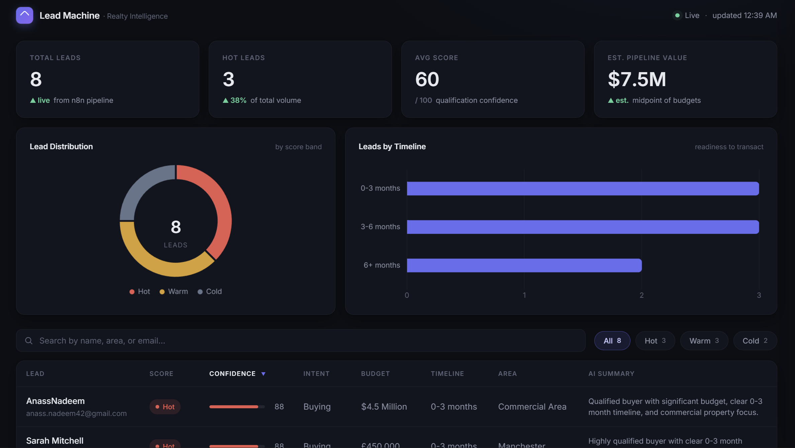
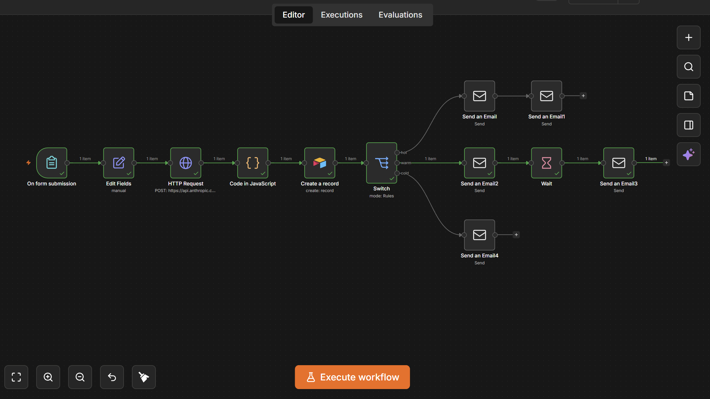
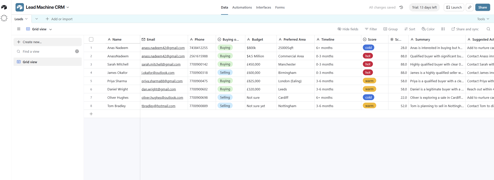

# Lead Machine — Real-Estate Lead Qualification & Booking Automation

An end-to-end demo that turns a raw web-form enquiry into a **scored, logged,
and followed-up** real-estate lead — automatically.

A prospect fills out a form → **Claude** scores the lead (hot / warm / cold) →
the lead is written to **Airtable** → an **n8n** Switch routes it → the prospect
gets a tailored follow-up email (hot leads include a **Cal.com** booking link) →
the operator watches everything land in a polished **lead-intelligence
dashboard**.

### 🔗 Live dashboard demo → **https://lead-machine-demo.netlify.app/**



---

## What's in the box

| Piece | What it does | Where |
| ----- | ------------ | ----- |
| **Lead-intelligence dashboard** | Dark, data-dense single-file UI: KPI cards, distribution donut, timeline chart, sortable/filterable leads table, slide-over lead detail with copyable AI follow-up | [`dashboard/`](./dashboard) |
| **n8n workflow** | The automation spine — form trigger → Claude scoring → Airtable → Switch → email. Built in the n8n UI and exported (12 nodes, importable) | [`n8n/Leads Automation.json`](./n8n/Leads%20Automation.json) |
| **Qualification prompt** | The system prompt Claude uses to score a lead and return strict JSON | [`qualification-prompt.md`](./qualification-prompt.md) |
| **Parse-score Code node** | n8n JavaScript that strips fences, parses Claude's JSON, and degrades gracefully on bad output | [`n8n/parse-score.code-node.js`](./n8n/parse-score.code-node.js) |
| **Parse-score tests** | Node test suite that runs the Code node against mocked Claude responses | [`n8n/parse-score.test.mjs`](./n8n/parse-score.test.mjs) |

---

## Architecture

```
                    Lead capture form (browser)
                              │  HTTP POST (JSON)
                              ▼
                   ┌────────────────────────────┐
                   │        n8n  (spine)         │
   Webhook ────────►  1. On form submission      │
                   │  2. Edit Fields (normalize) │
                   │  3. HTTP Request ───────────┼──► Claude API
                   │       (qualification prompt)│    claude-haiku-4-5-20251001
                   │  4. Code: parse score JSON ─┤    → {score, score_number,
                   │  5. Create record ──────────┼──► Airtable (Leads table)
                   │  6. Switch on score         │
                   │       hot ─┐                │
                   │      warm ─┤                │
                   │      cold ─┘                │
                   │  7. Send email ─────────────┼──► Gmail SMTP
                   │     (hot → + Cal.com link)  │
                   └────────────────────────────┘
                              │
                              ▼
                      Cal.com booking          Airtable export ──► dashboard/leads.json
                  (15-min discovery call)               │
                                                         ▼
                                            Lead-intelligence dashboard
```

### Data flow

1. **Capture** — a lead-capture form `POST`s JSON (name, email, phone, intent,
   budget, preferred area, timeline) to the n8n production webhook.
2. **Qualify** — n8n sends the payload to the Claude API with the system prompt
   in [`qualification-prompt.md`](./qualification-prompt.md). Claude returns
   **only** a JSON object (schema below). Model: **`claude-haiku-4-5-20251001`**
   — fast and cheap, the right tier for short structured classification.
3. **Parse** — the [`parse-score`](./n8n/parse-score.code-node.js) Code node
   strips any ```` ```json ```` fences, parses the object, and on failure
   defaults `score` to `warm` and flags the lead for manual review instead of
   dropping it.
4. **Persist** — n8n writes the raw lead plus the parsed score fields into the
   Airtable **Leads** table.
5. **Route** — a Switch node branches on `score`: **hot** → booking email with
   the Cal.com link; **warm** → nurture email; **cold** → low-touch / log only.
6. **Notify** — Gmail SMTP sends the email, using `followup_message` from
   Claude as the body.
7. **Visualize** — the Airtable Leads table is exported to
   [`dashboard/leads.json`](./dashboard/leads.json) and the dashboard renders it.

---

## The dashboard

A single, self-contained `dashboard/index.html` — vanilla HTML/CSS/JS, no build
step, no framework (Chart.js via CDN is the only dependency).

**Features**

- **KPI cards** — Total Leads, Hot Leads (% of total), Avg Score, and an
  estimated pipeline value summed from the lead budgets (count-up on load).
- **Charts** — a lead-distribution donut (hot/warm/cold) and a horizontal
  "leads by timeline" bar chart.
- **Leads table** — colored score pills, a thin confidence progress bar,
  intent / budget / timeline / area, and the AI summary. Click any header to
  sort; defaults to score descending so hot leads sit on top.
- **Search + filter chips** — live filtering by All / Hot / Warm / Cold and a
  free-text search over name, email, and area.
- **Slide-over detail** — click a row for the full lead: every field, the AI
  summary, the suggested action, and the AI-drafted follow-up in a copyable
  block.
- **Polish** — dark Linear/Vercel-style theme, responsive layout, soft
  fade-ins, and a graceful empty state when there's no data.

### Run it locally

The page `fetch`es `leads.json`, and browsers block `fetch()` over `file://`, so
serve the folder over HTTP (don't just double-click the file):

```bash
cd dashboard
python -m http.server 8000      # or:  npx serve -l 8000
```

Then open **http://localhost:8000**.

### Point it at real data

`leads.json` is an array of lead objects. To use a live export, replace
`leads.json` or change the `DATA_URL` constant in the script's commented
data-loading section (e.g. point it at an Airtable/n8n endpoint that returns the
same shape).

The included `dashboard/Leads-Grid view.csv` is a sample Airtable export; the
dashboard's data is generated from it. The converter maps Airtable's capitalized
/ space-padded headers (`Score ` → `score`, `Score Number` → `score_number`,
etc.), skips empty rows and rows whose summary contains `PARSE FAILED` or
`Could not parse`, and leaves `followup_message` blank when the export has no
such column.

> **Budgets & currency:** the budget parser handles `$800k`, `$4.5 Million`,
> `£450,000`, ranges like `$1.8M - $2.2M`, and free text such as `Not sure`
> (→ 0). The sample data mixes `$` and `£`, so the pipeline KPI is a rough
> order-of-magnitude estimate, not FX-accurate.

---

## Lead-score JSON contract

The Claude node returns **only** this object — no prose, no markdown fences
(full rubric in [`qualification-prompt.md`](./qualification-prompt.md)):

```json
{
  "score": "hot | warm | cold",
  "score_number": 0,
  "summary": "one-line summary of the lead",
  "reasons": ["why this score", "..."],
  "suggested_action": "what the operator/automation should do next",
  "followup_message": "ready-to-send email body for this lead"
}
```

| Band | Meaning | `score_number` |
| ---- | ------- | -------------- |
| **hot**  | buy/sell within **3 months**, has a budget, reachable | 75–100 |
| **warm** | **3–6 months** horizon, or exploring / not fully committed | 40–74 |
| **cold** | just browsing, no budget, or **6+ months** out | 0–39 |

---

## The n8n workflow

Built in the n8n UI. The flow: **On form submission → Edit Fields → HTTP Request
(Claude) → Code (parse score) → Create record (Airtable) → Switch → Send
email(s)**.

The full 12-node workflow is exported to
[`n8n/Leads Automation.json`](./n8n/Leads%20Automation.json) — import it via
**n8n → Workflows → Import from File** to recreate the pipeline. The Anthropic
API key in the export is redacted to the placeholder `YOUR_ANTHROPIC_API_KEY`;
set the real key (and the Airtable / Gmail / Cal.com credentials) in n8n's
credential store after importing.



Scored leads land in the Airtable **Leads** table:



### Manual setup checklist

**1. Accounts & credentials**

- [ ] **Airtable** — base with a **Leads** table (fields below); add the
      Personal Access Token to n8n.
- [ ] **Anthropic** — API key; add to n8n as an HTTP/Anthropic credential.
- [ ] **Cal.com** — confirm the discovery-call booking link is live.
- [ ] **Gmail** — enable 2FA, create an app password, add Gmail SMTP creds.

**2. Airtable Leads table fields**

`name`, `email`, `phone`, `intent` (buy/sell), `budget`, `preferred_area`,
`timeline`, `score` (hot/warm/cold), `score_number` (0–100), `summary`,
`reasons`, `suggested_action`, `followup_message`, `created_at`.

**3. Workflow nodes**

- [ ] **On form submission** (Webhook trigger) — production URL the form posts to.
- [ ] **Edit Fields** — normalize the incoming payload.
- [ ] **HTTP Request** — Claude, model `claude-haiku-4-5-20251001`, system
      prompt from [`qualification-prompt.md`](./qualification-prompt.md),
      `max_tokens` ~600.
- [ ] **Code (parse score)** — paste [`n8n/parse-score.code-node.js`](./n8n/parse-score.code-node.js),
      "Run Once for All Items".
- [ ] **Create record** — map lead + score fields into Airtable.
- [ ] **Switch** on `score`: hot → email **+ Cal.com link**; warm → nurture
      email; cold → log only / low-touch.
- [ ] **Send email** (Gmail) — `followup_message` as the body.

**4. Test & go live**

- [ ] Activate the workflow; confirm the webhook is live.
- [ ] Send a test lead; verify a row lands in Airtable with score fields.
- [ ] Verify a hot lead gets an email with the Cal.com link; warm/cold get the
      right non-booking email.
- [ ] Export the Leads table to `dashboard/leads.json` and confirm the dashboard
      renders it.

---

## Tests

The parse-score Code node has a Node test suite that runs the **actual node
source** against mocked Claude responses (clean JSON, fenced JSON, prose-wrapped
JSON, non-JSON / empty output, unknown scores, and missing fields):

```bash
node --test "n8n/**/*.test.mjs"
```

All 7 tests pass; no dependencies, no build step.

---

## Repo structure

```
.
├── dashboard/
│   ├── index.html              # the single-file lead-intelligence dashboard
│   ├── leads.json              # lead data the dashboard renders
│   └── Leads-Grid view.csv     # sample Airtable export (data source)
├── n8n/
│   ├── Leads Automation.json     # exported n8n workflow (importable; key redacted)
│   ├── parse-score.code-node.js  # parses Claude's JSON in the n8n Code node
│   └── parse-score.test.mjs      # tests for the parse-score node
├── resources/
│   ├── dashboard_preview.png
│   ├── n8n_preview.png
│   └── airtable_preview.png
├── qualification-prompt.md     # the lead-scoring system prompt
├── CLAUDE.md                   # architecture + conventions reference
├── .env.example                # credential placeholders (real .env is git-ignored)
└── README.md
```

---

## Secrets

Never commit secrets. `.env` (Airtable token, Gmail app password, Anthropic key,
webhook URL) is git-ignored — copy [`.env.example`](./.env.example) to `.env`
and fill it in. Canonical credentials live in **n8n's credential store**, not in
this repo.

---

## Stack

| Component | Choice | Role |
| --------- | ------ | ---- |
| Orchestration | **n8n** (UI-built) | The automation spine |
| LLM scoring | **Claude API** `claude-haiku-4-5-20251001` | Lead qualification → JSON |
| Data store | **Airtable** | Leads table |
| Booking | **Cal.com** | 15-min discovery call |
| Email | **Gmail SMTP** | Outbound follow-ups |
| Dashboard | **Vanilla HTML/CSS/JS + Chart.js** | Lead-intelligence UI |
| Hosting | **Netlify** | Live dashboard |

---

## Releases

**[v1.0.0](https://github.com/AnassNadeem/lead-machine-realestate/releases/tag/v1.0.0)** — first complete end-to-end demo:
n8n scoring + routing pipeline, Airtable persistence, and the live
lead-intelligence dashboard.

🔗 **Live demo:** https://lead-machine-demo.netlify.app/
